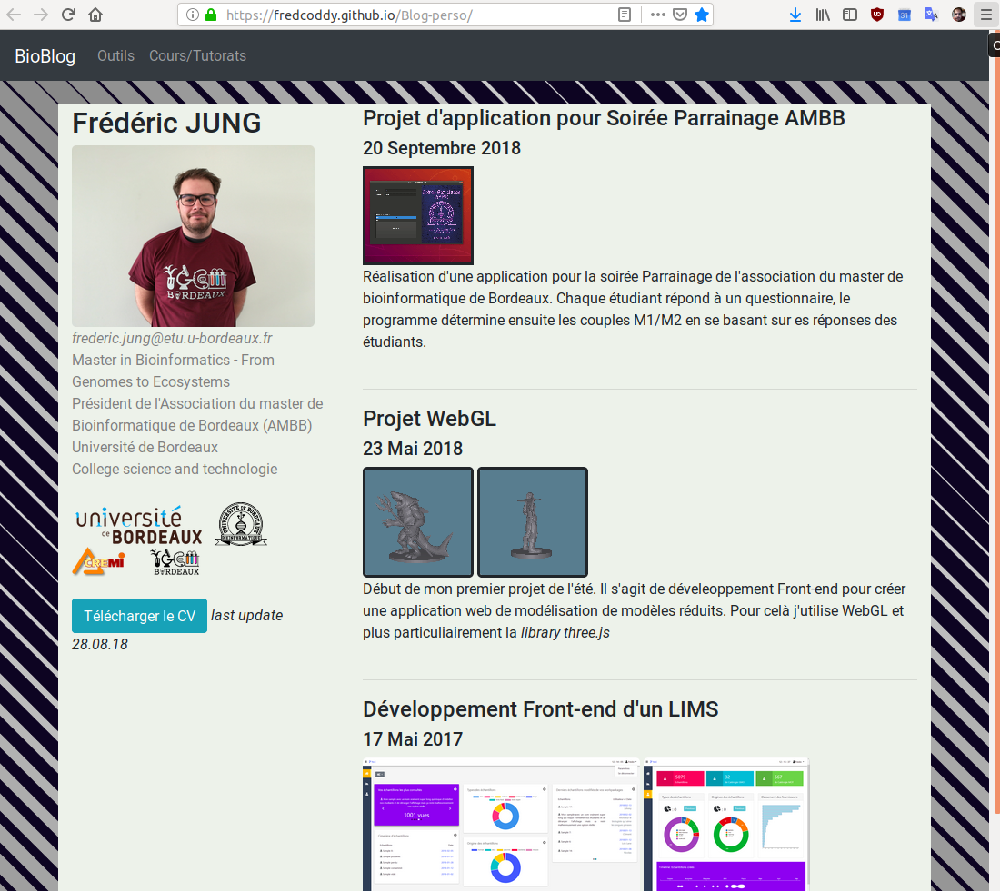

# Tests for personal blog UI 

This exemple of UI may be used with a Django app to generate a blog.

See the exemple in [description](https://fredcoddy.github.io/Blog-perso/).

# Dependencies 

- bootstrap 4 
- Jquery

# Futur improvements 

- develop a Django back-end app
- synchronize the back-end with the UI 
- use the django template system in the UI 
